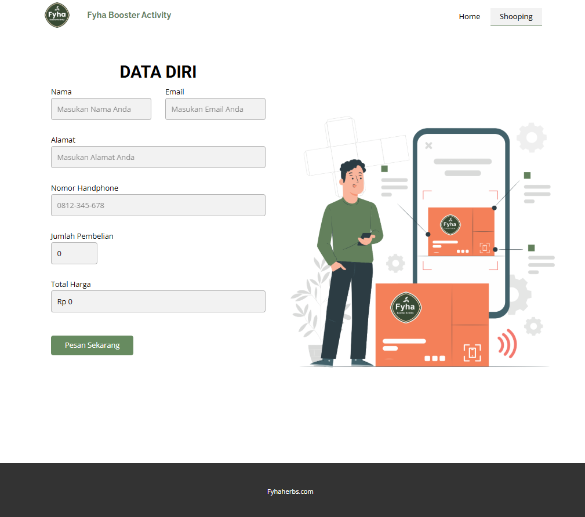

# Landing-Page-dengan-form-pembayaran-ke-Whatsapp
Landing Page Dengan Integrasi Form Pembayaran ke Whatsaap

# 💬 Landing Page – Pembayaran via WhatsApp

Sebuah landing page sederhana yang memungkinkan pengguna melakukan pemesanan dan mengirim data langsung ke WhatsApp dengan pesan terformat otomatis. Cocok untuk bisnis kecil, UMKM, atau personal brand yang ingin menyediakan metode pemesanan cepat tanpa integrasi payment gateway kompleks.

## 🧩 Fitur

- Formulir pemesanan (nama, produk, jumlah)
- Kirim otomatis ke WhatsApp dengan isi pesan terstruktur
- Mobile-friendly & ringan
- Mudah dikustomisasi

---

## 🚀 Cara Menggunakan

1. **Clone repositori ini**
   ```bash
   git clone https://github.com/USERNAME/landingpage-wa-payment.git
   cd landingpage-wa-payment
Edit nomor WhatsApp tujuan Buka pembayaran.html, ganti bagian berikut:

const nomorAdmin = "628123456789"; // ganti dengan nomor WA kamu
Buka index.html di browser
Isi form, klik tombol “Bayar”, dan kamu akan diarahkan ke WhatsApp Web/Apps.

## 🖼️ Demo
1. Landing Page
   - 
2. Halaman Pembayaran
   - 

## 📌 Catatan Teknis
Format nomor WhatsApp harus internasional tanpa tanda “+” (misal: 6281234567890)

Menggunakan metode Click to Chat WhatsApp

Tidak menyimpan data pengguna (client-side only)

## 📝 Lisensi
Rewebid Jasa Pembuatan Website 

© 2025 [RifkiMuazin]

---
